#  Multi-Tenant Learning Management System (LMS)

##  Live Demo
  👉 https://multi-tenant-lms.netlify.app

## 🌐 Frontend (Netlify):  
  👉  https://multi-tenant-lms.netlify.app

## ⚙️ Backend (Render):  
  👉 https://multi-tenant-lms-64v0.onrender.com

---

##  Overview

This project is a full-stack **Multi-Tenant Learning Management System (LMS)** where multiple organizations (tenants) can manage their own users, courses, and enrollments within an isolated environment.

Each tenant operates independently, ensuring secure and scalable data separation.

---

## Features

- Multi-tenant architecture (tenant-based data isolation)
- JWT-based authentication
- Role-based access control:
  -  Teacher → Create & manage courses
  -  Student → View & enroll in courses
- Separate dashboards for Teacher and Student
- Secure REST APIs (Django REST Framework)
- Responsive UI (works on mobile & desktop)

---

##  Tech Stack

**Backend**
- Django
- Django REST Framework
- JWT Authentication (SimpleJWT)

**Frontend**
- React (Vite)
- Axios
- Context API

**Database**
- PostgreSQL

**Deployment**
- Backend → Render
- Frontend → Netlify

---

##  Authentication Flow

1. User logs in with credentials  
2. Backend returns JWT token  
3. Token is stored in localStorage  
4. Axios interceptor attaches token to every request  
5. Backend verifies token for protected routes  

---

##  Multi-Tenant Design

- Each user is associated with a tenant
- Every model includes a tenant reference
- All queries are filtered using:

---
##  DashBoard

- Teacher Dashboard
  .Create new courses
  .View created courses

- Student Dashboard
  .View available courses
  .Enroll in courses

## Screenshots

- Login Page
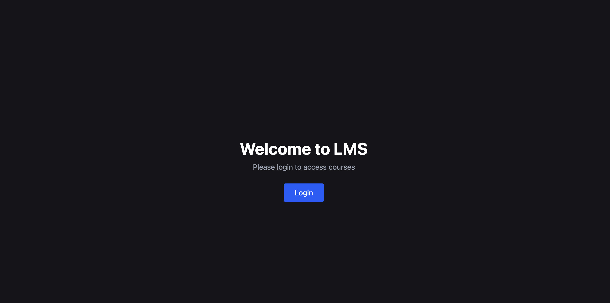
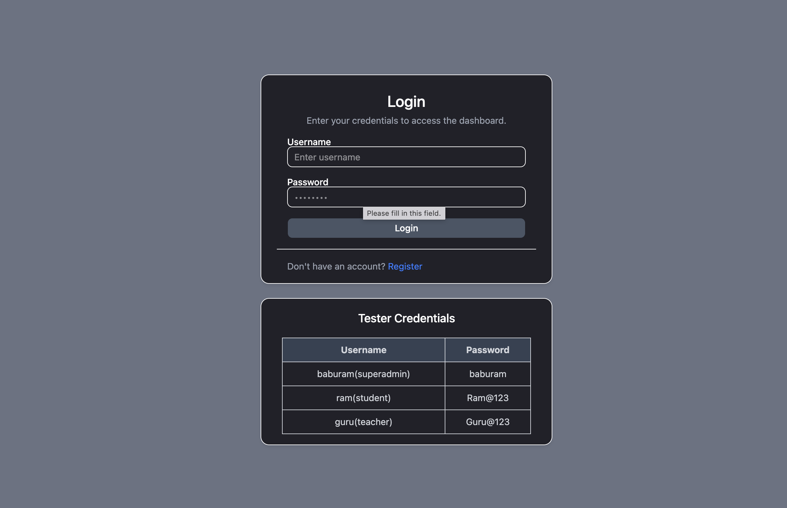

- Register Page
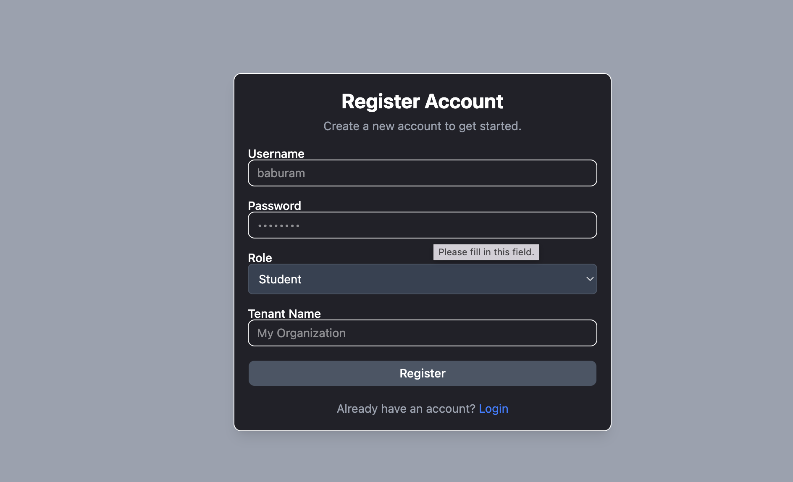

- super admin
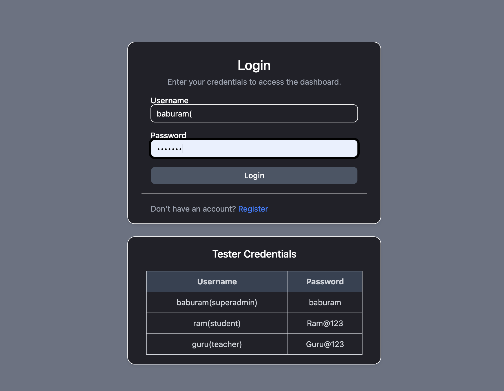
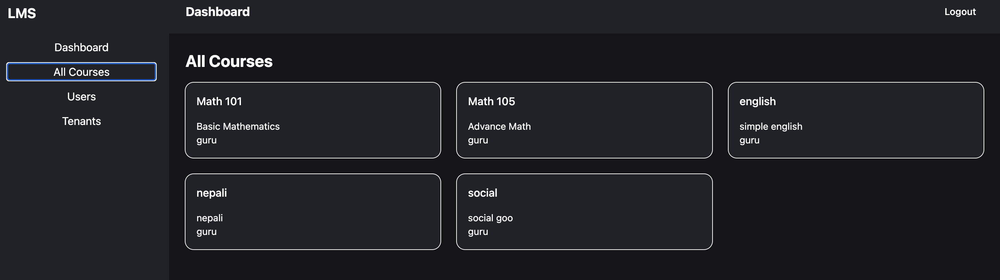
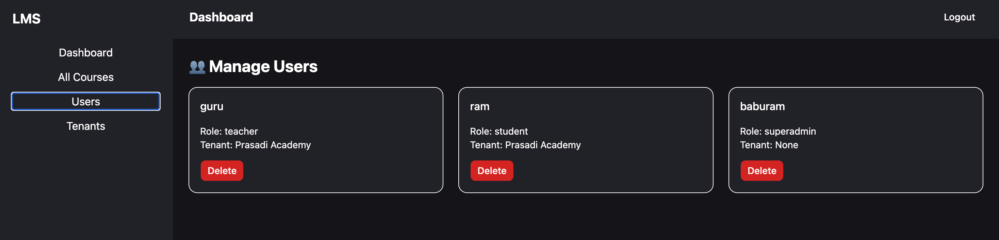

- Teacher portal
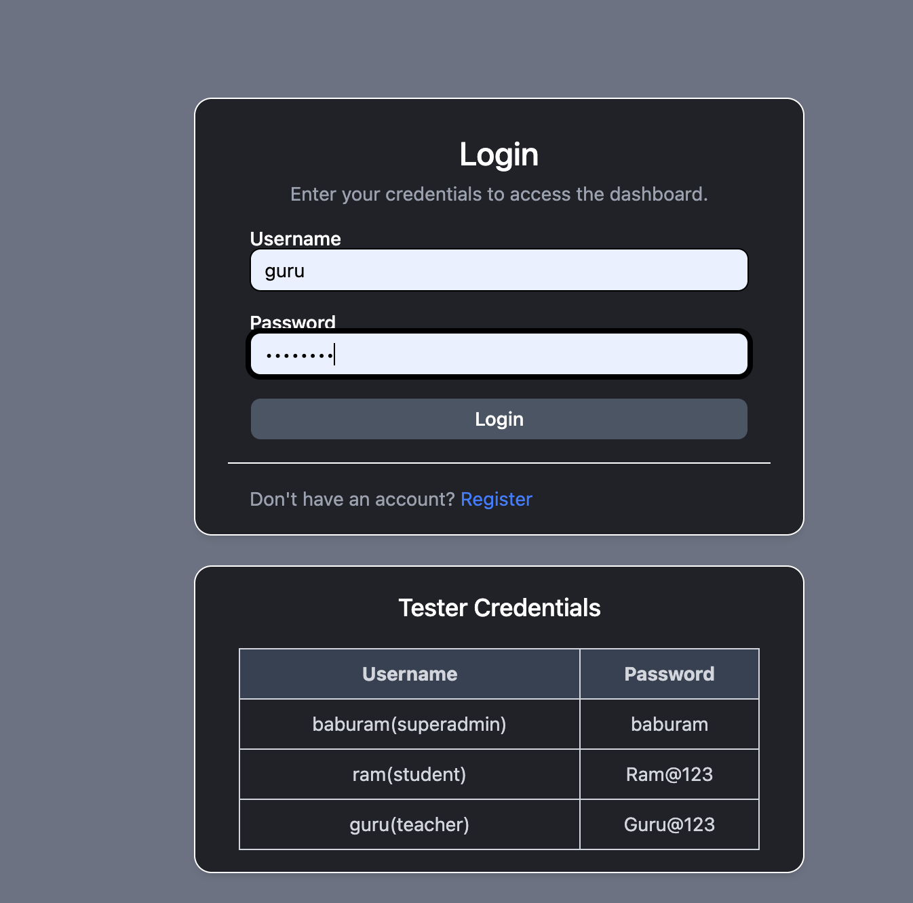
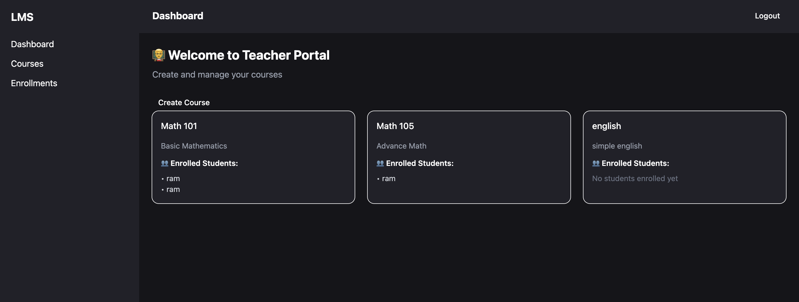
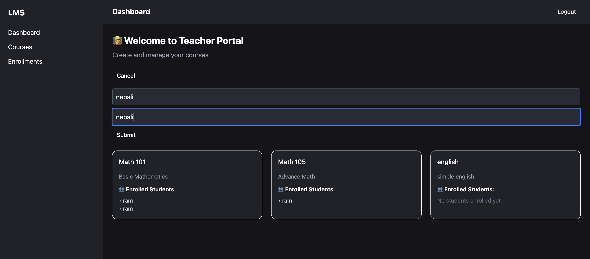

- Student portal
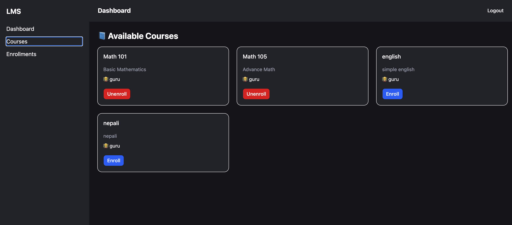
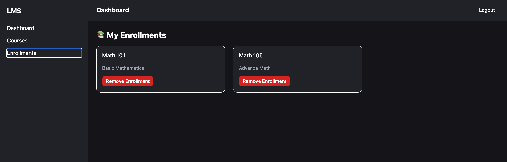
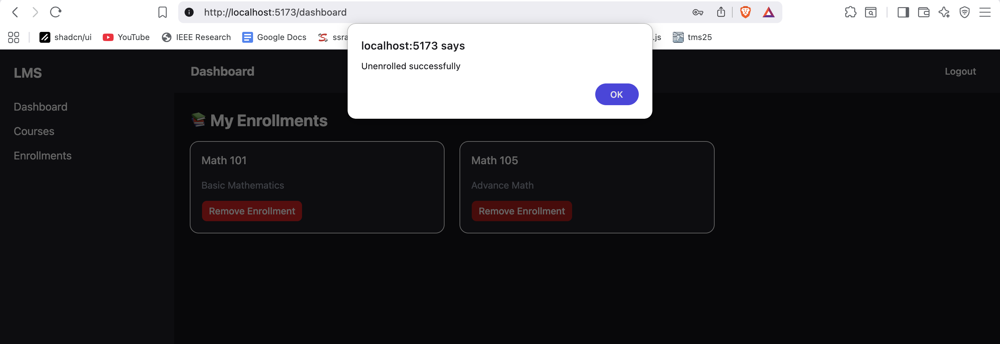

## Setup Instructions

git clone <https://github.com/Sisir8642/Multi-Tenant_LMS.git>
cd backend

python -m venv venv
source venv/bin/activate   # Windows: venv\Scripts\activate

pip install -r requirements.txt

# Configure PostgreSQL in settings.py or via environment variables

python manage.py migrate
python manage.py runserver

## Frontend Setup

cd frontend

npm install
npm run dev

## API Endpoints (Sample)

-- Auth
POST /api/auth/register/
POST /api/auth/login/

-- Courses
GET /api/courses/
POST /api/courses/

-- Enrollments
GET /api/enrollments/
POST /api/enrollments/

## Security
JWT authentication for secure API access
Role-based permissions using DRF
Tenant-based filtering to prevent data leakage

## Author

Baburam Bista
baburambista01@gmail.com